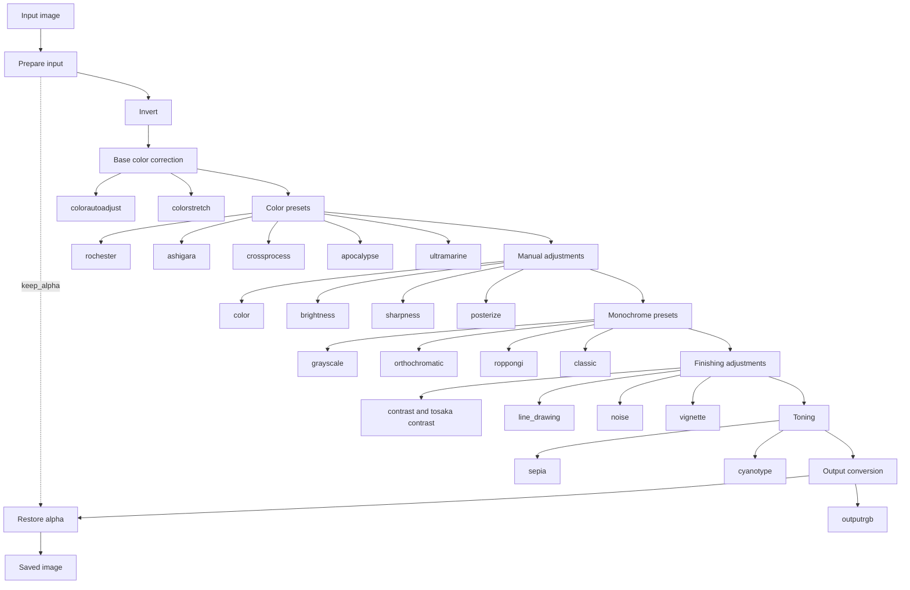

# Anshitsu

[](https://github.com/huideyeren/anshitsu/actions/workflows/testing.yml)

[](https://codecov.io/gh/huideyeren/anshitsu)

Anshitsu is a small digital photographic utility.

It was originally created as a simple retouching tool for batch processing
photos from the command line. "Anshitsu" means "darkroom" in Japanese.

The goal is not to replace a full photo editor. Anshitsu aims to provide
practical retouching presets that get images roughly 80 percent of the way
there with a short command.

## Install

Run this command in an environment where a currently supported Python version is installed.

We have tested it on Windows, Mac, and Ubuntu on GitHub Actions, but we have not tested it on Macs with Apple Silicon, so please use it at your own risk on Macs with Apple Silicon.

``` shell
pip install anshitsu
```

## Usage

It is as described in the following help.

``` shell
NAME
    anshitsu - Process Runnner for Command Line Interface

SYNOPSIS
    anshitsu <flags>

DESCRIPTION
    This utility converts the colors of images such as photos.

    If you specify a directory path, it will convert
    the image files in the specified directory.
    If you specify a file path, it will convert the specified file.
    If you specify an option, the specified conversion will be performed.

    Tosaka mode is named after Tosaka-senpai's "Tri-X de banzen"
    line from "Kyūkyoku Chōjin R". It aims for a grainy
    black-and-white photo look similar to Kodak Tri-X film.
    This mode converts the image to grayscale and adjusts contrast.
    Use floating-point numbers; values around 2.4 usually work well.

FLAGS
    --path=PATH
        Type: Optional[Union]
        Default: None
        Directory or file path. Defaults to None.
    -k, --keep_alpha=KEEP_ALPHA
        Type: bool
        Default: False
        Keep the alpha channel. Defaults to False.
    --colorautoadjust=COLORAUTOADJUST
        Type: bool
        Default: False
        Correct colors using Automatic Color Equalization. Defaults to False.
    --colorstretch=COLORSTRETCH
        Type: bool
        Default: False
        Apply gray-world white balance and color stretching. Defaults to False.
    -g, --grayscale=GRAYSCALE
        Type: bool
        Default: False
        Convert to grayscale. Defaults to False.
    --orthochromatic=ORTHOCHROMATIC
        Type: bool
        Default: False
        Convert to orthochromatic-style grayscale. Defaults to False.
    -i, --invert=INVERT
        Type: bool
        Default: False
        Invert image colors. Defaults to False.
    --color=COLOR
        Type: Optional[Union]
        Default: None
        Adjust color. Defaults to None.
    -b, --brightness=BRIGHTNESS
        Type: Optional[Union]
        Default: None
        Adjust brightness. Defaults to None.
    --sharpness=SHARPNESS
        Type: Optional[Union]
        Default: None
        Adjust sharpness. Defaults to None.
    --contrast=CONTRAST
        Type: Optional[Union]
        Default: None
        Adjust contrast. Defaults to None.
    -t, --tosaka=TOSAKA
        Type: Optional[Union]
        Default: None
        Use Tosaka mode. Defaults to None.
    --outputrgb=OUTPUTRGB
        Type: bool
        Default: False
        Convert a monochrome image to RGB. Defaults to False.
    --sepia=SEPIA
        Type: bool
        Default: False
        Colorize a monochrome image with sepia tones. Defaults to False.
    --cyanotype=CYANOTYPE
        Type: bool
        Default: False
        Colorize a monochrome image with cyanotype-like Prussian blue. Defaults to False.
    --rochester=ROCHESTER
        Type: bool
        Default: False
        Apply a warm color grade inspired by Kodak PORTRA 400. Defaults to False.
    --ashigara=ASHIGARA
        Type: bool
        Default: False
        Apply a vivid color grade inspired by Fujifilm Velvia 100. Defaults to False.
    --crossprocess=CROSSPROCESS
        Type: bool
        Default: False
        Apply a random cross-process-style color grade. Defaults to False.
    --apocalypse=APOCALYPSE
        Type: bool
        Default: False
        Apply a red-orange Velvia 100 cross-process preset. Defaults to False.
    --ultramarine=ULTRAMARINE
        Type: bool
        Default: False
        Apply a blue-forward color grade inspired by Kodak Ultramax. Defaults to False.
    --roppongi=ROPPONGI
        Type: bool
        Default: False
        Apply a smooth fine-grain monochrome preset. Defaults to False.
    --classic=CLASSIC
        Type: bool
        Default: False
        Apply a classic high-acutance monochrome preset. Defaults to False.
    -n, --noise=NOISE
        Type: Optional[Union]
        Default: None
        Add Gaussian noise. Defaults to None.
    --overwrite=OVERWRITE
        Type: bool
        Default: False
        Overwrite original files. Defaults to False.
    --version=VERSION
        Type: bool
        Default: False
        Show version. Defaults to False.
    -l, --line_drawing=LINE_DRAWING
        Type: bool
        Default: False
        Convert to a line drawing. Defaults to False.
    --posterize=POSTERIZE
        Type: Optional[Union]
        Default: None
        Posterize the image. Defaults to None.
    --vignette=VIGNETTE
        Type: Optional[Union]
        Default: None
        Darken image edges with a radial vignette. Defaults to None.
```

If a directory is specified in the path, an `anshitsu_out` directory will be created in the specified directory, and the converted JPEG, PNG, and supported RAW images will be stored in PNG format.

If you specify a JPEG, PNG, or supported RAW image file as the path, an `anshitsu_out` directory will be created in the directory where the image is stored, and the converted image will be stored in PNG format.

RAW images are developed with `rawpy` before entering the normal Anshitsu processing pipeline. RAW support depends on the LibRaw support available through the installed `rawpy` version.

**Note:** Unsupported file formats are skipped during directory processing. If an unsupported file is specified directly, Pillow or the RAW loader will report an error.

## Library Usage

Anshitsu can also be used as a small image processing library. The core API is
`Processor`, which accepts a Pillow `Image` and returns a processed Pillow
`Image`.

``` python
from anshitsu.image_io import open_image
from anshitsu.process.processor import Processor


image = open_image("input.jpg")

processed = Processor(
    image=image,
    rochester=True,
    vignette=0.4,
    noise=2.0,
).process()

processed.save("output.png")
```

The same API can be used from a web API, a desktop GUI application, or another
Python script. The caller is responsible for reading the input image and saving
or returning the processed image.

## Processing Flow

Anshitsu applies selected operations in a fixed order. When multiple options are
specified, this flow defines how they are combined.



## Algorithms

The following algorithms are available in this tool.

### RGBA to RGB Convert

Converts an image that contains Alpha, such as RGBA, to image data that does not contain Alpha.
Transparent areas will be filled with white.

This algorithm is performed on any image file.

### invert

Inverts the colors of an image using Pillow's built-in algorithm.

In the case of negative film, color conversion that takes into account the film base color is not performed, but we plan to follow up with a feature to be developed in the future.

### colorautoadjust

Applies color correction using the Automatic Color Equalization algorithm described in the following paper.

This process is more time consuming than the algorithm used in "colorstretch", but it can reproduce more natural colors.

(References)

A. Rizzi, C. Gatta and D. Marini, "A new algorithm for unsupervised global and local color correction.", Pattern Recognition Letters, vol. 24, no. 11, 2003.

### colorstretch

The "gray world" and "stretch" algorithms described in the following paper are combined to apply color correction.

This process is faster than the algorithm used in "colorautoadjust".

(References)

D. Nikitenko, M. Wirth and K. Trudel, "Applicability Of White-Balancing Algorithms to Restoring Faded Colour Slides: An Empirical Evaluation.", Journal of Multimedia, vol. 3, no. 5, 2008.

### grayscale

Convert a color image to grayscale using the algorithm described in the following article.

[Python でグレースケール(grayscale)化](https://qiita.com/yoya/items/dba7c40b31f832e9bc2a#pilpillow-%E3%81%A7%E3%82%B0%E3%83%AC%E3%83%BC%E3%82%B9%E3%82%B1%E3%83%BC%E3%83%AB%E5%8C%96-numpy-%E3%81%A7%E4%BD%8E%E8%BC%9D%E5%BA%A6%E5%AF%BE%E5%BF%9C)

Note: This article is written in Japanese.

### orthochromatic

Converts a color image to orthochromatic-style grayscale.

This conversion darkens red tones and lifts blue tones to approximate the look of older orthochromatic film.

### Tosaka mode

Tosaka mode is named after Tosaka-senpai's "Tri-X de banzen" line from "Kyūkyoku Chōjin R". It aims for a grainy black-and-white photo look similar to Kodak Tri-X film.

Use floating-point numbers when using this mode; values around 2.4 usually work well.

When this mode is specified, color images will also be converted to grayscale.

### roppongi

Applies a smooth fine-grain monochrome preset inspired by Fujifilm ACROS.

This preset uses a mild orthopanchromatic response, compresses highlights, keeps blacks firm, and adds restrained fine grain.

### classic

Applies a classic high-acutance monochrome preset inspired by Kodak TRI-X in Rodinal.

This preset is less aggressive than Tosaka mode. It uses a firm tone curve, visible but restrained grain, mild sharpening, and highlight protection.

### outputrgb

Converts a monochrome image to RGB.

### rochester

Applies a warm, low-saturation color grade inspired by Kodak PORTRA 400.

### ashigara

Applies a vivid, high-contrast color grade inspired by Fujifilm Velvia 100.

### crossprocess

Applies a random cross-process-style color grade.

Cross processing can produce unpredictable color shifts depending on film, chemistry, and exposure. This preset intentionally varies the color response each time it runs.

### apocalypse

Applies a red-orange cross-process preset inspired by Fujifilm Velvia 100.

This preset leans into the orange-to-red color cast associated with cross-processing Velvia 100. The strength of the red shift varies slightly each time it runs.

### ultramarine

Applies a blue-forward consumer color film grade inspired by Kodak Ultramax.

This preset emphasizes blues while keeping reds slightly restrained, with highlight compression to avoid harsh clipping.

### noise

Add Gaussian noise.

To add noise, you need to specify a floating-point number; a value of about 10.0 will be just right.

### vignette

Darkens image edges with a radial vignette.

To add a vignette, specify a floating-point number between 0.0 and 1.0.

## Special Thanks

We are using the following libraries.

[shunsukeaihara/colorcorrect](https://github.com/shunsukeaihara/colorcorrect)
